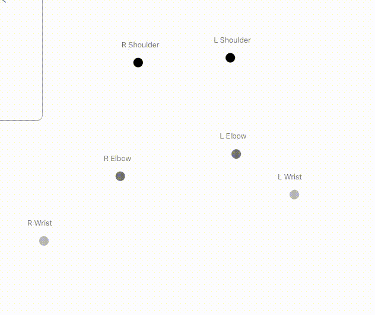
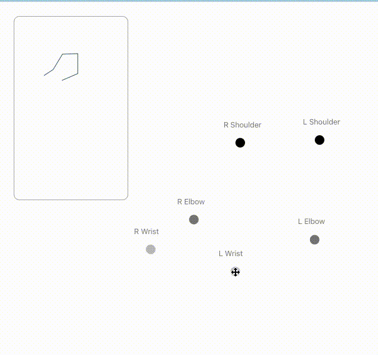
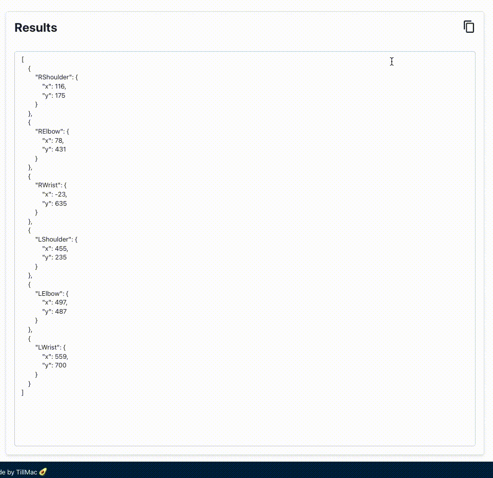

## Before we started...

The birth of this little side project is because I need to adjust the Live2D Web SDK model with my own hands. But I can't change it without lots of data. So I think maybe building a site that could make me drag body points, and will return a JSON about the pose I adjusted might be a good idea.

Demo: [https://2d-draggable-body-keypoints.sunyubro.com](https://2d-draggable-body-keypoints.sunyubro.com)

## How to Use?

### Step.1 Drag the Body Points

First, dragging body points to whatever you want them to.

### Step.2 Inspect the result in the top left corner

Second, we could check if the body points we've set are in the correct location via the top left window.

### Step.3 Copy the body keypoints JSON

Finally, we could click the copy button once the pose is good for you.

